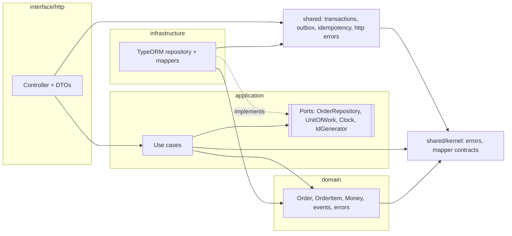
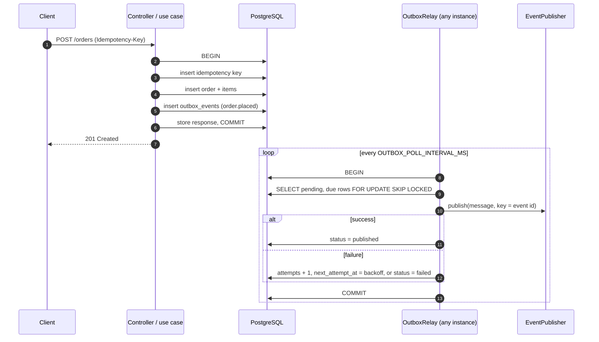

# nestjs-clean-architecture

A NestJS 11 service template for a small domain (an online store's orders) that
shows how I structure a backend that has to be correct under failure: feature
modules with enforced clean layers, a transactional outbox, idempotent writes,
optimistic concurrency and RFC 9457 errors.

It is deliberately small. Each piece is the minimum that is still real, and the
trade-offs are written down in [`docs/adr`](docs/adr).

## What it demonstrates

- **Layering with a checked dependency rule.** `domain/` is pure TypeScript,
  `application/` depends only on the domain and its own ports, and the rule fails
  CI through dependency-cruiser. ([ADR 0001](docs/adr/0001-layering-and-dependency-rule.md))
- **Transactional outbox.** The aggregate and its domain events commit in one
  transaction. A polling relay claims rows with `FOR UPDATE SKIP LOCKED`, retries
  with exponential backoff and ends in a terminal `failed` status.
  ([ADR 0002](docs/adr/0002-transactional-outbox.md))
- **Unit of work via `AsyncLocalStorage`.** Repositories join the active
  transaction without receiving it as an argument.
  ([ADR 0003](docs/adr/0003-unit-of-work-async-local-storage.md))
- **Money as integer minor units.** No floats, explicit currency.
  ([ADR 0004](docs/adr/0004-money-integer-minor-units.md))
- **Idempotency-Key** on `POST /orders`, stored in the same transaction as the
  order. ([ADR 0005](docs/adr/0005-idempotency-keys.md))
- **Optimistic concurrency** with a `version` column; a lost update is a `409`.
- **Explicit data mappers** at every boundary (domain, persistence, outbox, HTTP),
  injectable and tested, with persisted data validated on the way in.
  ([ADR 0006](docs/adr/0006-data-mappers.md))
- **One error model, one global filter.** `BaseError` in a pure shared kernel;
  RFC 9457 Problem Details, known Postgres failures mapped (`409`, retryable
  `503`), internals never leaked.
  ([ADR 0007](docs/adr/0007-error-model-and-http-mapping.md))
- **Operational basics:** zod-validated env that fails at boot, structured logs
  (pino), health check with a DB probe, OpenAPI, graceful shutdown, migrations
  instead of `synchronize`, non-root multi-stage image.
- **Tests at the right level:** unit (domain, use cases with fakes), integration
  and e2e on a real PostgreSQL via Testcontainers.

## Architecture



Arrows point in the direction of the allowed import. `domain` imports nothing
outside itself except the pure `shared/kernel`; `application` imports only
`domain`, its own ports and the kernel;
`infrastructure` and `interface` depend inwards; `shared` never imports a feature.

### Outbox flow



## Folder map

```
src/
  main.ts, app.module.ts
  modules/orders/
    domain/             Order (aggregate root), OrderItem, Money, OrderId, OrderStatus,
                        events/ (OrderPlaced, OrderCancelled), errors/
    application/        use-cases/ (PlaceOrder, CancelOrder, GetOrder, ListOrders),
                        ports/ (OrderRepository, UnitOfWork, Clock, IdGenerator),
                        errors/, testing/ (in-memory fakes)
    infrastructure/     persistence/ (TypeORM entities, repository,
                        mappers/ order persistence + outbox message),
                        system clock, uuid generator, TypeORM unit of work
    interface/http/     controller, dto/, mappers/ (order HTTP mapper), cursor codec
    orders.module.ts    the only place that wires use cases to adapters
  shared/
    kernel/             pure TypeScript: errors/ (BaseError, DomainError,
                        ApplicationError), mapping/ (DataMapper, Mapper)
    config/             zod env schema
    database/           data source options, migrations/, TransactionManager
    outbox/             OutboxWriter, OutboxRelay, relay worker, EventPublisher port,
                        LoggingEventPublisher
    idempotency/        IdempotencyService, request hashing
    http/               global exception filter, error mapping, validation pipe, OpenAPI
    health/             /health (Terminus)
test/
  integration/          repository, outbox relay, idempotency (Testcontainers)
  e2e/                  HTTP contract and background worker (Testcontainers)
docs/adr/               architecture decision records
```

## Quick start

Requirements: Node 22 (`nvm use`), pnpm, Docker.

```bash
cp .env.example .env
pnpm install
docker compose up -d --wait        # PostgreSQL 17
pnpm migration:run
pnpm start:dev                     # http://localhost:3000, OpenAPI at /docs
```

If port 5432 is taken, set `POSTGRES_PORT` in `.env` and adjust `DATABASE_URL`.

```bash
# Place an order (amounts are in minor units: 1999 = 19.99 USD)
curl -i -X POST localhost:3000/orders \
  -H 'content-type: application/json' \
  -H 'Idempotency-Key: 7d1f2c0e-order-1' \
  -d '{"customerId":"customer-42","items":[
        {"sku":"MUG-1","name":"Ceramic mug","quantity":2,"unitPrice":{"amount":1999,"currency":"USD"}}]}'

# Same key and body: the original response is replayed (Idempotent-Replayed: true).
# Same key, different body: 422 application/problem+json.

curl localhost:3000/orders/<id>
curl 'localhost:3000/orders?limit=20'                    # newest first; use nextCursor to page
curl -X POST localhost:3000/orders/<id>/cancel           # 200, then 409 on the second call
curl localhost:3000/health
```

Errors are `application/problem+json`:

```json
{
  "type": "urn:problem-type:order.already_cancelled",
  "title": "Conflict",
  "status": 409,
  "detail": "Order 3f2504e0-... is already cancelled",
  "instance": "/orders/3f2504e0-.../cancel",
  "code": "order.already_cancelled",
  "details": { "orderId": "3f2504e0-..." }
}
```

`details` is present only when the error carries data that is safe to expose.
Unexpected errors answer a generic `500` and are logged server side.

| Status | Code                                                                                                                                              |
| ------ | ------------------------------------------------------------------------------------------------------------------------------------------------- |
| 400    | `idempotency.invalid_key`, `pagination.invalid_cursor`; request validation (no code, `errors` lists each field)                                   |
| 404    | `order.not_found`; unknown route (no code)                                                                                                        |
| 409    | `order.already_cancelled`, `order.concurrent_modification`, `persistence.unique_violation`                                                        |
| 422    | `order.empty`, `order.invalid`, `order.invalid_id`, `order.invalid_quantity`, `money.invalid`, `money.currency_mismatch`, `idempotency.key_reuse` |
| 503    | `persistence.retryable` (serialization failure or deadlock), with `Retry-After`                                                                   |
| 500    | anything unexpected, no code                                                                                                                      |

See the published events with `docker compose exec postgres psql -U app -c
"select event_type, status, attempts from outbox_events"`. The default
publisher logs each event.

### Configuration

All variables are validated at boot (`src/shared/config/env.ts`); see
[`.env.example`](.env.example). The relay is controlled by `OUTBOX_RELAY_ENABLED`,
`OUTBOX_POLL_INTERVAL_MS`, `OUTBOX_BATCH_SIZE`, `OUTBOX_MAX_ATTEMPTS` and
`OUTBOX_BACKOFF_BASE_MS` / `OUTBOX_BACKOFF_MAX_MS`.

### Migrations

| Script                                                        | Purpose                                                         |
| ------------------------------------------------------------- | --------------------------------------------------------------- |
| `pnpm migration:run` / `migration:revert`                     | apply / undo the latest migration                               |
| `pnpm migration:generate src/shared/database/migrations/Name` | diff entities against the database                              |
| `pnpm migration:run:prod`                                     | same as `run`, against the compiled `dist/` (used in the image) |

Migrations are not run on app start. Run them as a separate deploy step before
rolling out the new version.

### Docker

```bash
docker build -t nestjs-clean-architecture .
docker run --rm -p 3000:3000 -e DATABASE_URL=postgres://... nestjs-clean-architecture
```

## Testing

| Script                        | What it runs                                                                                                                                                                                                                                                              |
| ----------------------------- | ------------------------------------------------------------------------------------------------------------------------------------------------------------------------------------------------------------------------------------------------------------------------- |
| `pnpm test`                   | unit tests: domain, use cases against in-memory fakes, pure helpers. No I/O.                                                                                                                                                                                              |
| `pnpm test:integration`       | PostgreSQL via Testcontainers, migrations applied. Repository round trip, order + outbox atomicity and rollback, optimistic concurrency, idempotency (including concurrent duplicates), relay publish / backoff / terminal failure, two relays without double publishing. |
| `pnpm test:e2e`               | supertest against the whole app: place / get / list / cancel, Problem Details shapes (code and details), idempotent replay, background relay worker.                                                                                                                      |
| `pnpm lint`, `pnpm typecheck` | ESLint (type-aware) and `tsc --noEmit`                                                                                                                                                                                                                                    |
| `pnpm check:architecture`     | dependency-cruiser layer rules                                                                                                                                                                                                                                            |

Integration and e2e tests need Docker. A single container is started per run and
each test file gets its own database cloned from a migrated template.

## Design decisions

1. [Feature modules with clean layers and an enforced dependency rule](docs/adr/0001-layering-and-dependency-rule.md)
2. [Transactional outbox with a SKIP LOCKED polling relay](docs/adr/0002-transactional-outbox.md)
3. [UnitOfWork with the transaction propagated through AsyncLocalStorage](docs/adr/0003-unit-of-work-async-local-storage.md)
4. [Money as integer minor units plus an ISO 4217 currency](docs/adr/0004-money-integer-minor-units.md)
5. [Idempotency-Key for POST /orders, stored in the same transaction](docs/adr/0005-idempotency-keys.md)
6. [Explicit data mappers at every boundary](docs/adr/0006-data-mappers.md)
7. [One error model, one global filter, RFC 9457 responses](docs/adr/0007-error-model-and-http-mapping.md)

Other choices worth knowing:

- Use cases return domain objects; the HTTP mapper in `interface/http` shapes the
  response and turns the request DTO into a command.
- Domain and application errors extend `BaseError` (`kind`, `code`, optional
  `details`); the global filter maps the kind to HTTP. Request-shape errors are
  `400`, business rule violations are `422`, state conflicts are `409`.
- Listing uses keyset pagination on `(placed_at, id)` with an opaque cursor.
- After `save`, an aggregate instance keeps its old `version`; reload before
  changing it again.

## Extending

### Replace the logging publisher with Kafka, SNS, etc.

Implement `EventPublisher` and reject on failure, so the relay can retry:

```ts
@Injectable()
export class KafkaEventPublisher extends EventPublisher {
  constructor(private readonly producer: Producer) {
    super();
  }

  async publish(message: OutboxMessage): Promise<void> {
    await this.producer.send({
      topic: 'orders',
      messages: [{ key: message.id, value: JSON.stringify(message) }],
    });
  }
}
```

Then change one line in `src/shared/outbox/outbox.module.ts`:
`{ provide: EventPublisher, useClass: KafkaEventPublisher }`. Consumers must
deduplicate on `message.id` (delivery is at-least-once). For per-aggregate
ordering, partition by `message.aggregateId`.

### Add a module

1. Create `src/modules/<name>/{domain,application,infrastructure,interface/http}`
   and keep the same dependency direction. `pnpm check:architecture` applies to
   every folder under `modules/` automatically.
2. Put the ports in `application/ports` as abstract classes and the use cases as
   plain classes.
3. Implement the ports in `infrastructure/`. To emit events, have the aggregate
   record `DomainEvent`s and, in the repository, call `OutboxWriter.write` with
   the pulled events inside `TransactionManager.run`.
4. Add an entity (`*.entity.ts` is picked up automatically) and a migration
   (`pnpm migration:generate ...`).
5. Wire everything in `<name>.module.ts` and import it from `AppModule`.

## License

MIT, see [LICENSE](LICENSE).
